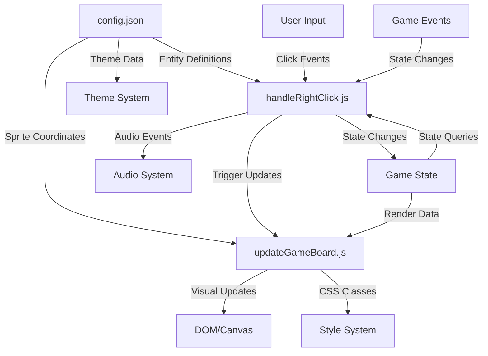

# Mindsweeper RPG: Core Orchestration & Game Mechanics

## Executive Summary

Mindsweeper is a sophisticated RPG-enhanced minesweeper game built with a modular, configuration-driven architecture. Three key files serve as the primary orchestrators of the game experience:

1. **`config.json`** - The Central Game Orchestrator & Rule Engine
2. **`handleRightClick.js`** - The Primary Interaction Controller & Game State Manager
3. **`updateGameBoard.js`** - The Visual State Synchronization & Rendering Engine

This document provides a comprehensive analysis of how these files work together to create a cohesive, extensible, and maintainable game system.

---

## 🎯 **config.json: The Central Game Orchestrator**

### Overview
The `config.json` file serves as the **single source of truth** for all game rules, mechanics, balance, and content. It operates as a sophisticated configuration engine that drives every aspect of the game experience without requiring code changes.

### Core Orchestration Functions

#### **1. Game Metadata & Foundation**
```json
{
    "name": "MindSweeper",
    "version": "0.0.8",
    "description": "A game of RPG Minesweeper",
    "starting_max_health": 8,
    "starting_max_experience": 5,
    "rows": 10,
    "cols": 14
}
```
- **Purpose**: Establishes core game parameters and identity
- **Impact**: Controls board size, starting player stats, and game versioning
- **Flexibility**: Can be modified to create different difficulty levels or game modes

#### **2. Theme System Architecture**
```json
"themes": {
    "cats": {
        "name": "Cats Style",
        "description": "A whimsical world ruled by felines...",
        "sprite_sheets": {
            "monsters": "assets-nb/tiny_dungeon_monsters.png",
            "icons": "assets-nb/icons16x16.png",
            "new_sprites": "assets-nb/mindsweeper-nb-16x16-cat.png"
        },
        "entity_overrides": { /* Complete entity redefinitions */ }
    }
}
```

**Orchestration Mechanism:**
- **Theme Switching**: Enables complete game experience transformation
- **Asset Management**: Dynamically loads appropriate sprite sheets
- **Content Overrides**: Allows themes to completely redefine entities
- **Narrative Coherence**: Maintains thematic consistency across all game elements

#### **3. Entity Database & Behavior System**
```json
"tile_types": {
    "E1": {
        "name": "Cave Rat",
        "encoding": 1,
        "symbol": "1",
        "count": 14,
        "level": 1,
        "tags": ["enemy", "onReveal-hostile", "rat"],
        "sprites": {
            "revealed": {"x": 0, "y": 3, "sprite_sheet": "new_sprites"},
            "dead": {"x": 2, "y": 3}
        }
    }
}
```

**Key Orchestration Features:**
- **Behavioral Tags**: `["enemy", "onReveal-hostile", "rat"]` drive game logic
- **Level System**: Directly controls damage and experience calculations
- **Count Management**: Determines board generation and entity distribution
- **Sprite Coordination**: Maps visual states to coordinate systems
- **Special Mechanics**: Tags like `"trigger-reveal-all-rats"` enable complex interactions

#### **4. Sprite Rendering System**
```json
"sprite_settings": {
    "cell_width": 16,
    "cell_height": 16,
    "tile_states": ["hidden", "revealed", "dead", "claimed"],
    "default_hidden_sprite": {"x": 7, "y": 6},
    "default_flag_sprite": {"x": 3, "y": 7}
}
```

**Rendering Orchestration:**
- **Coordinate Systems**: Standardizes sprite positioning across sheets
- **State Management**: Defines visual states for all entities
- **Fallback Systems**: Provides defaults for missing sprite definitions
- **Performance Optimization**: Enables sprite caching and efficient rendering

### Configuration-Driven Game Design Benefits

1. **Content Flexibility**: New entities, themes, and mechanics without code changes
2. **Balance Iteration**: Rapid gameplay tuning through config adjustments
3. **Localization Support**: Theme system enables cultural adaptations
4. **A/B Testing**: Different configurations for user experience optimization
5. **Deployment Variants**: Environment-specific configurations

---

## 🎮 **handleRightClick.js: The Primary Interaction Controller**

### Overview
This module serves as the **central nervous system** of game interactions, orchestrating all player input and translating it into appropriate game state changes. It implements the core game loop logic with sophisticated state management and animation systems.

### Core Orchestration Functions

#### **1. Main Interaction Hub: `handleTileClick()`**

**Architecture Pattern:**
```javascript
function handleTileClick(event) {
    // 1. Input Processing & Validation
    const td = event.target.closest('td');
    const row = parseInt(td.dataset.row);
    const col = parseInt(td.dataset.col);
    const tileData = JSON.parse(td.dataset.tileData);
    
    // 2. Animation State Protection
    if (tilesInAnimation[`${row},${col}`]) {
        return; // Prevent interaction during animations
    }
    
    // 3. Special Input Handling
    if (event.shiftKey && gameState[row][col] === TILE_STATE.HIDDEN) {
        showAnnotationPopover(td, row, col, event);
        return;
    }
    
    // 4. Entity-Specific Logic Routing
    if (isSkyglass(tileData)) {
        handleSkyglass(row, col, tileData);
        return;
    }
    
    // 5. State-Specific Processing
    // ... extensive state machine logic
}
```

**Orchestration Mechanisms:**

1. **Input Validation & Routing**: Ensures clean data flow and prevents invalid interactions
2. **Animation Synchronization**: Protects game state during visual transitions
3. **Entity Detection**: Uses configuration data to determine appropriate behavior
4. **State Machine Management**: Handles complex state transitions for all entity types
5. **Effect Coordination**: Triggers audio, visual, and gameplay effects

#### **2. Specialized Interaction Handlers**

**Skyglass Interaction System:**
```javascript
function handleSkyglass(row, col, tileData) {
    if (gameState[row][col] === TILE_STATE.HIDDEN) {
        gameState[row][col] = TILE_STATE.REVEALED;
        // First click reveals the skyglass
    } else if (gameState[row][col] === TILE_STATE.REVEALED) {
        gameState[row][col] = TILE_STATE.CLAIMED;
        reveal3x3Square(); // Second click uses the skyglass
    }
}
```

**Key Features:**
- **Multi-Stage Interactions**: Implements complex interaction patterns
- **Progressive Disclosure**: Reveals functionality gradually
- **State Persistence**: Maintains interaction state across game sessions

#### **3. Combat & Progression System**

**Enemy Interaction Pipeline:**
```javascript
// Animation sequence orchestration
tilesInAnimation[`${row},${col}`] = true;
gameState[row][col] = TILE_STATE.REVEALED;

setTimeout(() => {
    gameState[row][col] = TILE_STATE.DYING;
    startDyingAnimation(row, col);
    
    setTimeout(() => {
        // Process damage, experience, special drops
        const enemyLevel = getThemedEntityLevel(tileData);
        takeDamage(enemyLevel, tileData);
        addExperience(enemyLevel);
        
        // Handle special entity behaviors
        if (canWeakenAllMines(tileData)) {
            gameState[row][col] = TILE_STATE.DROPPED_ITEM;
            td.dataset.revealType = 'mines';
        }
        
        delete tilesInAnimation[`${row},${col}`];
    }, 500);
}, 500);
```

**Orchestration Features:**
- **Timing Coordination**: Manages complex animation sequences
- **State Locking**: Prevents race conditions during animations
- **Effect Chaining**: Coordinates multiple system responses
- **Data Flow**: Manages information between config, state, and UI systems

#### **4. Special Mechanics Implementation**

**Crystal Pattern System:**
- **Pattern Recognition**: Tracks color sequences across multiple interactions
- **Reward Management**: Implements progressive reward systems
- **State Transformation**: Handles complex state changes based on patterns

**Drop System Management:**
- **Probabilistic Rewards**: Implements percentage-based drop systems
- **Context-Sensitive Items**: Creates different items based on entity types
- **Multi-Stage Claims**: Enables complex claiming interactions

### Interaction Controller Benefits

1. **Centralized Logic**: All interaction rules in one maintainable location
2. **State Safety**: Prevents invalid state transitions and race conditions
3. **Extensibility**: Easy to add new interaction patterns
4. **Performance**: Efficient event handling and state management
5. **Debugging**: Clear interaction flow for troubleshooting

---

## 🎨 **updateGameBoard.js: The Visual State Synchronization Engine**

### Overview
This module serves as the **rendering orchestrator**, translating game state into visual representation while maintaining high performance and visual consistency. It implements a sophisticated multi-layered rendering system that adapts to themes, states, and special effects.

### Core Orchestration Functions

#### **1. Master Rendering Controller: `updateGameBoard()`**

**Architecture Pattern:**
```javascript
function updateGameBoard() {
    const cells = document.querySelectorAll('#game-board td');
    
    cells.forEach(td => {
        const row = parseInt(td.dataset.row);
        const col = parseInt(td.dataset.col);
        const tileData = JSON.parse(td.dataset.tileData);
        const state = gameState[row][col];
        
        // 1. Class Management System
        td.classList.remove('revealed', 'dead', 'dying', /* ... all states */);
        const cssClass = state.replace(/_/g, '-').toLowerCase();
        td.classList.add(cssClass);
        
        // 2. Canvas Rendering Pipeline
        const canvas = td.querySelector('canvas');
        const threatLevel = sumNeighboringEnemyLevels(row, col);
        
        // 3. State-Specific Rendering Logic
        switch (state) {
            case TILE_STATE.REVEALED:
                renderRevealedTile(canvas, tileData, row, col);
                break;
            // ... extensive state handling
        }
    });
}
```

**Rendering Orchestration:**

1. **DOM State Synchronization**: Maintains CSS classes for styling consistency
2. **Canvas Management**: Handles individual canvas elements for sprite rendering
3. **Layer Coordination**: Manages multiple sprite layers for complex visuals
4. **Performance Optimization**: Efficient DOM manipulation and rendering
5. **Theme Integration**: Adapts rendering based on current theme configuration

#### **2. Multi-Layered Sprite System**

**Layer Architecture:**
```javascript
// Example: Revealed entity rendering
const baseTile = getTileCoordinates(TILE_STATE.REVEALED);
const revealedSprite = getSpriteCoordinates(tileData, 'revealed');
drawLayeredSprite(canvas, [baseTile, null, revealedSprite]);
```

**Layer Types:**
1. **Base Tile Layer**: Foundation tile appearance
2. **Variation Layer**: Optional tile variations for visual diversity
3. **Entity Layer**: Main entity sprite based on state
4. **Effect Layer**: Special effects, animations, highlights
5. **UI Layer**: Annotations, threat numbers, status indicators

#### **3. Theme-Aware Rendering System**

**Crystal Rendering Example:**
```javascript
if (isCrystal(tileData)) {
    revealedSprite = getCrystalSpriteCoordinates(tileData, row, col, 'revealed');
    if (!revealedSprite.spriteSheet) {
        revealedSprite.spriteSheet = 'new_sprites';
    }
    canvas.classList.add('crystal-canvas');
}
```

**Theme Integration Features:**
- **Dynamic Sprite Selection**: Chooses appropriate sprites based on theme
- **Coordinate Translation**: Maps logical positions to theme-specific coordinates
- **Asset Management**: Ensures correct sprite sheets are used
- **Style Application**: Applies theme-specific CSS classes

#### **4. Special Effect Management**

**Animation System:**
```javascript
case TILE_STATE.DYING:
    if (useSpriteMode) {
        const frameNumber = getDyingFrame(row, col);
        drawSkullFrame(canvas, frameNumber);
    } else {
        drawTextOnCanvas(canvas, '†', '#FF0000');
    }
    break;
```

**Effect Categories:**
- **Death Animations**: Skull sprite sequences for enemy deaths
- **Highlight Effects**: Visual feedback for special interactions
- **Pattern Rewards**: Special rendering for achievement completions
- **Interactive States**: Visual cues for clickable elements

#### **5. Performance & Optimization Systems**

**Rendering Optimizations:**
```javascript
// Canvas reuse and efficient updates
const canvas = td.querySelector('canvas');
clearCanvas(canvas); // Only clear when necessary

// Conditional rendering based on state changes
if (previousState !== currentState) {
    renderStateChange(canvas, tileData, state);
}
```

**Performance Features:**
- **Selective Updates**: Only re-renders changed tiles
- **Canvas Pooling**: Reuses canvas elements efficiently
- **Sprite Caching**: Minimizes sprite sheet access
- **Layer Optimization**: Skips unnecessary layer rendering

### Visual Engine Benefits

1. **Consistent Rendering**: Unified visual state across all game elements
2. **Theme Flexibility**: Easy visual transformation through configuration
3. **Performance**: Optimized rendering pipeline for smooth gameplay
4. **Extensibility**: Simple to add new visual states and effects
5. **Debugging**: Clear visual feedback for all game states

---

## 🔄 **Inter-System Orchestration & Data Flow**

### System Integration Architecture



### Data Flow Patterns

#### **1. Configuration-Driven Initialization**
```javascript
// main.js initialization flow
fetchConfigAndInit() → 
  loadConfig(config.json) → 
    applyTheme(config.themes[selectedTheme]) → 
      initializeGame(config.tile_types) →
        createBoard(config.rows, config.cols)
```

#### **2. Interaction-State-Render Cycle**
```javascript
// Core game loop
handleTileClick(event) →
  validateInput(config.rules) →
    updateGameState(tileData) →
      triggerEffects(audio, animation) →
        updateGameBoard() →
          renderVisualState(sprites, css)
```

#### **3. Cross-System Communication**

**Event Coordination:**
- **Input Events**: User interactions trigger state changes
- **State Events**: State changes trigger rendering updates  
- **System Events**: Special conditions trigger multiple system responses
- **Configuration Events**: Theme changes trigger system-wide updates

**Data Sharing Mechanisms:**
- **Global State**: Shared game state accessible by all systems
- **Configuration Context**: Config data available throughout the application
- **Event Bus**: Loose coupling through event-driven communication
- **DOM Data Attributes**: Rich metadata stored in DOM elements

### System Orchestration Benefits

1. **Loose Coupling**: Systems interact through well-defined interfaces
2. **High Cohesion**: Each system has clear, focused responsibilities
3. **Data Consistency**: Single source of truth prevents conflicts
4. **Extensibility**: New systems can integrate cleanly
5. **Maintainability**: Clear separation enables independent development

---

## 🚀 **Advanced Orchestration Patterns**

### 1. **Configuration-Driven Behavior**

**Dynamic Entity Properties:**
```javascript
// Entity behavior determined by config tags
const tileData = config.tile_types[entityKey];
if (tileData.tags.includes('trigger-reveal-all-rats')) {
    revealAllLivingRats();
}
if (tileData.tags.includes('onReveal-hostile')) {
    handleHostileEncounter(tileData);
}
```

**Benefits:**
- **No Hard-Coding**: All behaviors defined in configuration
- **Easy Balancing**: Adjust properties without code changes
- **Extensible Logic**: New behaviors through tag combinations

### 2. **State Machine Architecture**

**Tile State Management:**
```javascript
// Complex state transitions managed systematically
const stateTransitions = {
    [TILE_STATE.HIDDEN]: {
        validNext: [TILE_STATE.REVEALED, TILE_STATE.FLAGGED],
        triggers: ['click', 'rightClick']
    },
    [TILE_STATE.REVEALED]: {
        validNext: [TILE_STATE.DYING, TILE_STATE.CLAIMED],
        triggers: ['secondClick', 'autoProcess']
    }
};
```

**Benefits:**
- **Predictable Behavior**: Clear state transition rules
- **Error Prevention**: Invalid transitions blocked
- **Easy Debugging**: State flow is explicit and traceable

### 3. **Layered Rendering Pipeline**

**Multi-Pass Rendering:**
```javascript
// Rendering in distinct, coordinated phases
renderPhases = [
    'clearCanvas',      // Clear previous content
    'drawBaseTile',     // Foundation layer
    'drawVariation',    // Visual variety
    'drawEntity',       // Main entity sprite
    'drawEffects',      // Special effects
    'drawUI'           // UI overlays
];
```

**Benefits:**
- **Visual Consistency**: Standardized rendering order
- **Performance**: Selective phase execution
- **Extensibility**: Easy to add new rendering phases

### 4. **Event-Driven Coordination**

**System Communication:**
```javascript
// Loose coupling through events
gameEvents.emit('entityKilled', {
    entity: tileData,
    position: {row, col},
    rewards: {experience: level, drops: items}
});

// Multiple systems can respond
achievements.on('entityKilled', checkKillAchievements);
audio.on('entityKilled', playKillSound);
ui.on('entityKilled', updateEntityCount);
```

**Benefits:**
- **Decoupling**: Systems don't need direct references
- **Extensibility**: Easy to add new event listeners
- **Maintainability**: Changes in one system don't affect others

---

## 📊 **Performance & Optimization**

### Rendering Performance

**Selective Updates:**
- Only re-render tiles that have changed state
- Batch DOM updates to minimize reflow
- Use canvas for complex sprite operations
- Cache sprite coordinates and theme data

**Memory Management:**
- Reuse canvas elements across state changes
- Efficient sprite sheet loading and caching
- Garbage collection-friendly object patterns
- Minimize DOM queries through caching

### State Management Performance

**Efficient State Storage:**
- Use typed arrays for large game boards
- Minimize object creation in hot paths
- Cache frequently accessed configuration data
- Optimize animation state tracking

**Computation Optimization:**
- Pre-calculate sprite coordinates during initialization
- Cache threat level calculations
- Use efficient algorithms for pattern matching
- Minimize configuration file parsing

---
